

  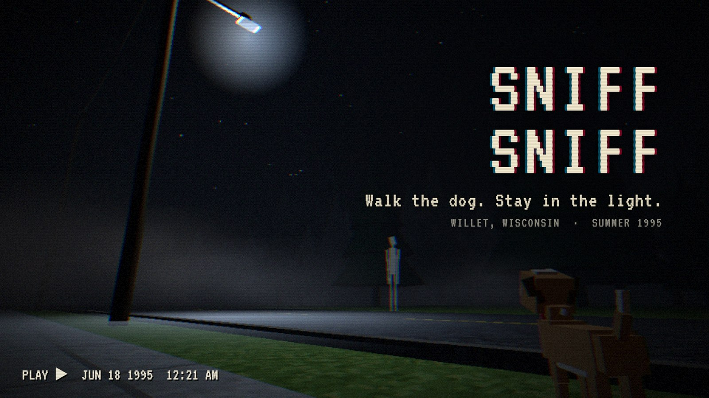

  <b>A first-person horror game about walking your dog.</b> 
  Willet, Wisconsin. Summer 1995. People keep losing their dogs. 
  You just got a new one.

  <code>Horror</code>&nbsp;
  <code>Psychological Horror</code>&nbsp;
  <code>First-Person</code>&nbsp;
  <code>Walking Simulator</code>&nbsp;
  <code>Atmospheric</code>&nbsp;
  <code>Dogs</code>&nbsp;
  <code>1990s</code>&nbsp;
  <code>Retro</code>&nbsp;
  <code>Lo-fi</code>&nbsp;
  <code>Short</code>

<table align="center">
  <tr><td>STATUS</td><td>Playable prototype: <b>Day 1</b> + <b>Night 1</b></td></tr>
  <tr><td>PLATFORM</td><td>Web browser (Chrome recommended)</td></tr>
  <tr><td>DEVELOPER</td><td><a href="https://github.com/Jason1317">Jason1317</a></td></tr>
  <tr><td>PRICE</td><td>Free</td></tr>
</table>

 

  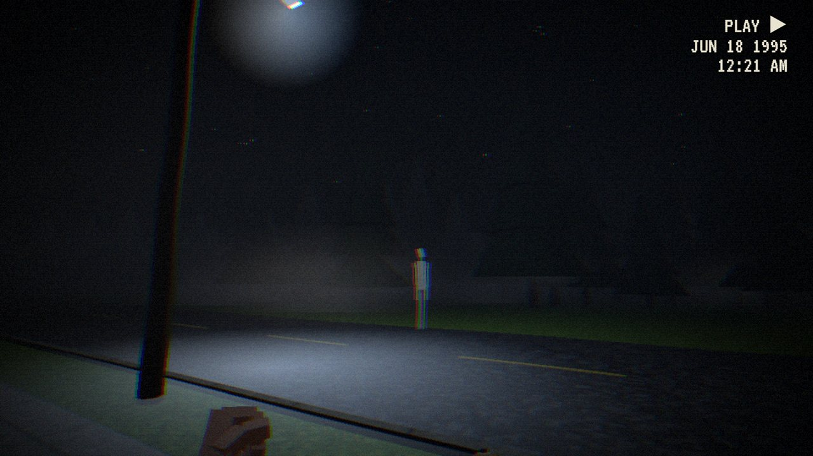

<table>
  <tr>
    <td width="25%"><a href="docs/media/02_something-in-the-yard.jpg">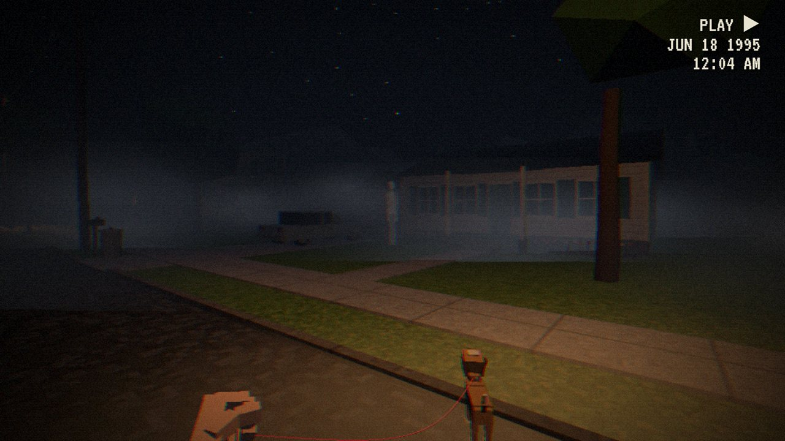</a></td>
    <td width="25%"><a href="docs/media/03_mrs-kessler.jpg">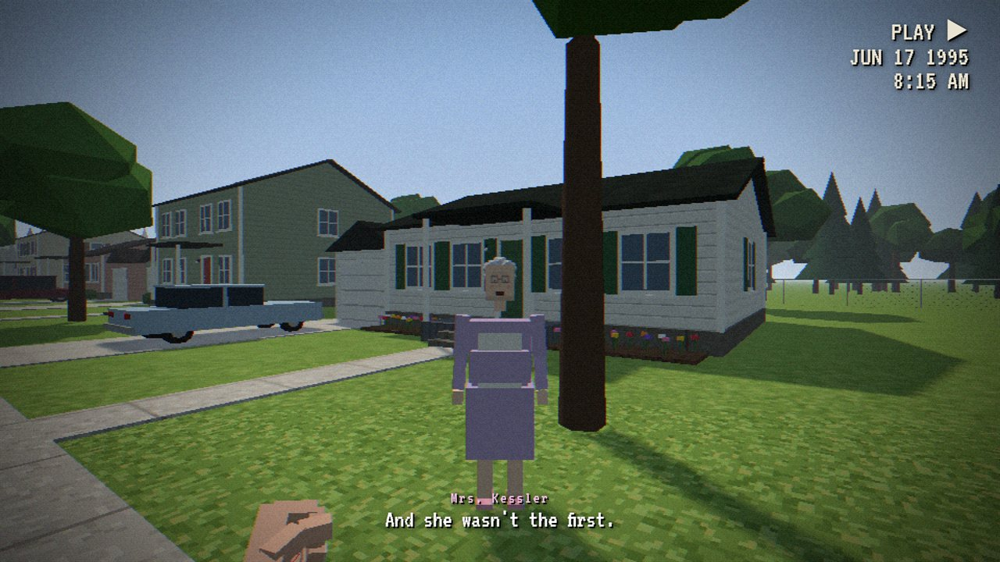</a></td>
    <td width="25%"><a href="docs/media/04_walt.jpg">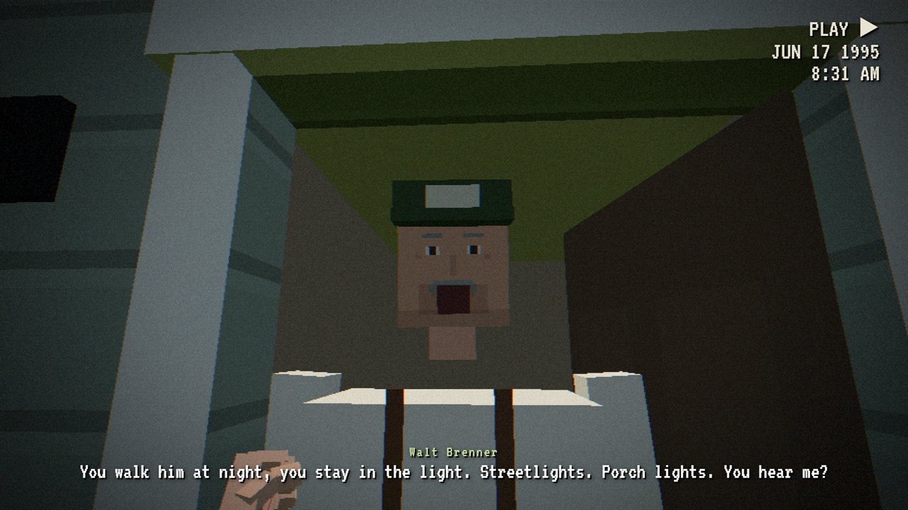</a></td>
    <td width="25%"><a href="docs/media/05_mr-lindqvist.jpg">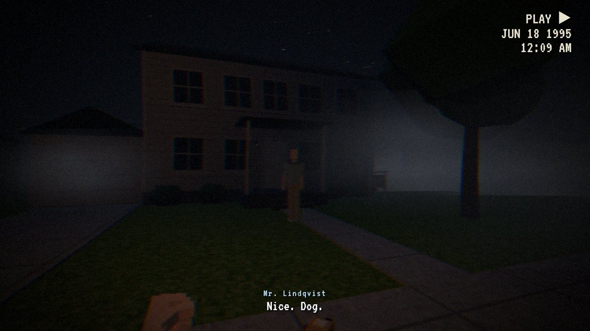</a></td>
  </tr>
  <tr>
    <td width="25%"><a href="docs/media/06_midnight.jpg">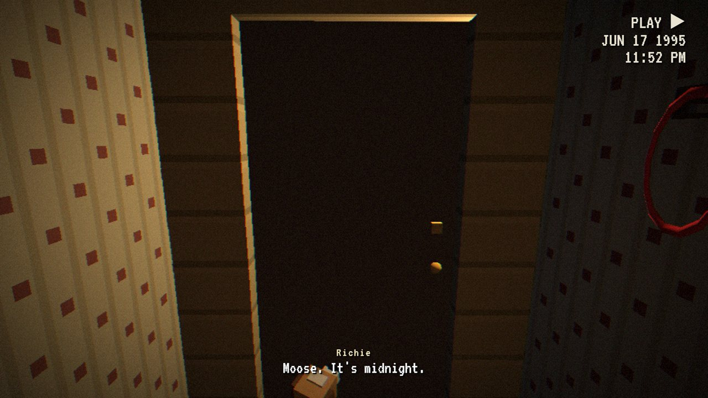</a></td>
    <td width="25%"><a href="docs/media/07_cigarette.jpg">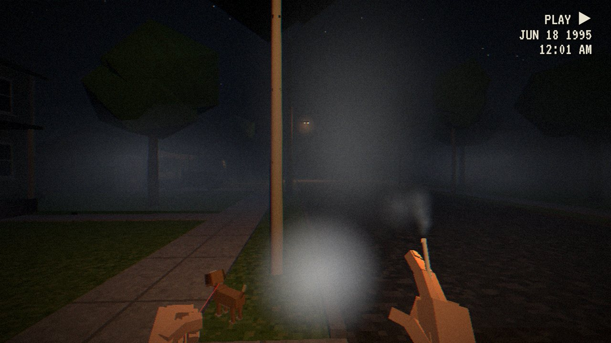</a></td>
    <td width="25%"><a href="docs/media/08_across-the-road.jpg">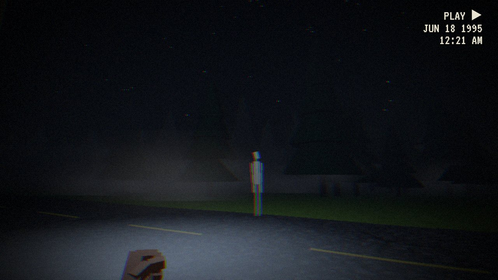</a></td>
    <td width="25%"><a href="docs/media/09_morning-walk.jpg">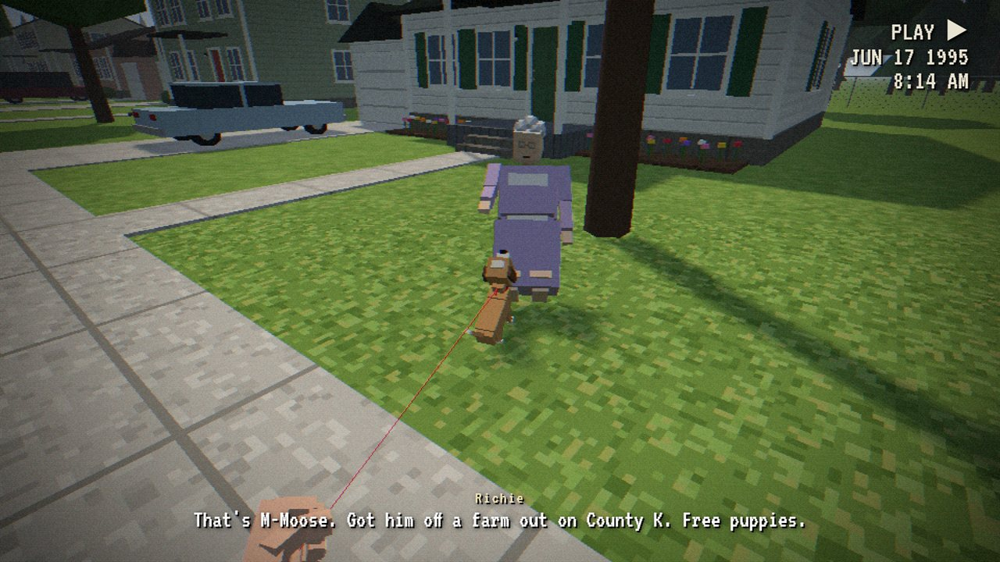</a></td>
  </tr>
</table>

 

> ### ▶&nbsp; Play Sniff Sniff
> **Free prototype.** Double-click **`start.bat`**. The first run installs dependencies, then the game opens at **http://localhost:5174** in your browser.
>
> 🎧 &nbsp;*Best played at night, with headphones.*

 

## ABOUT THIS GAME

You are **Richie**, a nervous young man who just rented the old Gunderson place on Birch Lane. You don't know anyone in town. You have a new puppy named **Moose**.

He needs walking twice a day: once in the morning, and once at midnight.

The neighbors are friendly, mostly. The lost-pet posters on the telephone poles are new, mostly. Somebody tells you to **stay in the light**. You should listen.

 

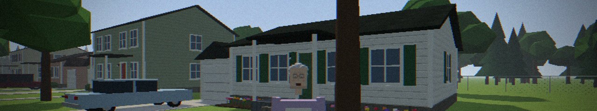

### DAY 1 &nbsp;·&nbsp; *The Morning Walk*

Meet the street on a bright June morning, with Moose tugging at the leash.

- **Mrs. Kessler** introduces herself, shakes your hand, makes a fuss over Moose, and asks for help with her porch light. Whatever you decide, she gives you a letter.
- **The jogger** goes by with his Walkman.
- **The Lindqvists** are moving in. He waves a little too long.
- **Walt Brenner** won't open his door all the way. He has advice for you.
- **Lost-pet posters** on the poles, and Moose doing his business (bring a bread bag).

<table>
  <tr>
    <td width="50%"></td>
    <td width="50%"></td>
  </tr>
</table>

 

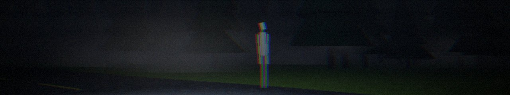

### NIGHT 1 &nbsp;·&nbsp; *The Midnight Walk*

Same street. Fog. Sodium streetlights and one mercury lamp that won't stay on. Mist banks catch the lamplight. Crickets, katydids, a bug zapper, a train horn far off.

- **What you did today matters tonight.** Is Mrs. Kessler's light on? If it isn't, something might be standing in her yard.
- A smashed mailbox. A bike bell somewhere in the fog. **Mr. Lindqvist** standing on his lawn in the dark. Walt's truck alarm.
- Then **Mill Road**.
- **Moose leads the way.** When Richie gets scared, his breathing and heartbeat get worse. A cigarette helps. So does petting Moose.

<table>
  <tr>
    <td width="50%"></td>
    <td width="50%"></td>
  </tr>
</table>

 

### EVERY GESTURE, HAND-ANIMATED

There are no cutscenes. Everything happens through Richie's own hands:

- 🚗 &nbsp;The drive in: hands on the wheel, turning the key, climbing out under the roof
- 🐕 &nbsp;Clipping the leash on Moose in the passenger seat. He licks your hand, hops down, and shakes off.
- ✋ &nbsp;Petting him. Picking up after him with a bread bag, then tossing it in a trash can.
- 🚬 &nbsp;The whole cigarette ritual: pack, lid flip, shake one out, to the lips, a lighter that fails once, inhale, two-finger hold, exhale, flick the butt
- 🚪 &nbsp;Knocking. A door opening on its chain. Handshakes. Taking a letter and handing it over.
- 💡 &nbsp;Unscrewing and replacing a porch light bulb
- 🔒 &nbsp;Unlocking the house and leaving at night, and the ending, where Richie bolts and chains the door and slides down it

 

## CONTROLS

| | |
|---|---|
| <kbd>W</kbd> <kbd>A</kbd> <kbd>S</kbd> <kbd>D</kbd> | Walk |
| <kbd>Shift</kbd> | Walk faster |
| <kbd>Mouse</kbd> | Look (click the game to capture the mouse) |
| <kbd>E</kbd> | Interact · pet Moose · pick choices |
| <kbd>1</kbd> <kbd>2</kbd> · <kbd>W</kbd> <kbd>S</kbd> | Dialogue choices |
| <kbd>C</kbd> | Smoke (press again to take a drag) |
| <kbd>Q</kbd> | Whistle for Moose |
| <kbd>Esc</kbd> | Pause: sensitivity, volume, voice volume, picture |

<b>Playtest shortcuts</b>

 

- **Skip to night** on the title screen jumps straight to the midnight walk (Mrs. Kessler's light stays off).
- `http://localhost:5174/?bulb=1`, then **Skip to night**: the same, but with her light fixed.
- `http://localhost:5174/?skipcar`: skips the car intro and starts on the driveway with Moose leashed.

 

## SYSTEM REQUIREMENTS

<table>
  <tr>
    <th width="50%" align="left">MINIMUM</th>
    <th width="50%" align="left">RECOMMENDED</th>
  </tr>
  <tr valign="top">
    <td>
      <b>OS:</b> Windows (for <code>start.bat</code>), or anything that runs Node.js 
      <b>Software:</b> Node.js with npm 
      <b>Browser:</b> Any modern browser with WebGL 2 
      <b>Input:</b> Keyboard and mouse 
      <b>Storage:</b> Under 1 MB built
    </td>
    <td>
      <b>OS:</b> Windows 
      <b>Software:</b> Node.js with npm 
      <b>Browser:</b> Google Chrome 
      <b>Input:</b> Keyboard and mouse 
      <b>Sound:</b> Headphones (the audio is positional)
    </td>
  </tr>
</table>

 

## CONTENT NOTE

Horror themes and dread, missing pets, and on-screen smoking. Smoking is part of how Richie copes with fear.

 

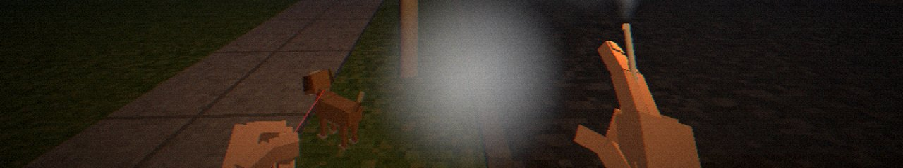

## HOW IT'S BUILT

**All of it is code: no 3D models, no audio files.** The whole build is under a megabyte.

| Folder | What's inside |
|---|---|
| `src/world/` | The town (houses, cars, trees, poles, corn, woods, water tower), merged into a few draw calls. Textures painted on tiny canvases. Sky, fog, and the streetlight system. |
| `src/player/` | The first-person rig, and the hands: jointed fingers, two-bone arm IK, rest poses |
| `src/entities/` | Moose (procedural trot, ears, tail, leash physics, behaviors) and the neighbors (jointed people, faces, mouths, gestures) |
| `src/audio/` | Every sound synthesized at load time (footsteps per surface, Moose's tag jingle, barks, crickets, doors, lighter...), positional HRTF audio, fog muffling, reverb. Voices use the browser's speech synthesis. |
| `src/story/` | `sequences.js` (the transitions) and `story.js` (the Day 1 / Night 1 script and triggers) |
| `src/render/` | Low-res rendering, then a dithered VHS-style post pass |

**Tuning notes**

- **Sound mix:** every sound's loudness lives in one table, `LEVELS` in `src/audio/synth.js` (in dB). If something's too loud or too quiet, change its number there.
- **HUD:** the task list and the direction pointer are derived from story state each frame (`computeTasks` in `src/story/story.js`).

 

## COMING SOON

- **Day 2 (Sunday):** the consequences of the night. Did Mrs. Kessler come out for her paper?
- **Moose grows up between days.** `dog.setAge(0..1)` is already wired up.
- **Real voice acting.** Every line already goes through one `speak(character, text)` call, so recorded lines can drop in later.

 

  

  <i>Walk the dog. Stay in the light.</i>

  Full-resolution press kit (cover art and 1920×1080 screenshots) lives in <code>press/</code>, kept out of git. The README uses web-sized copies in <code>docs/media/</code>.

